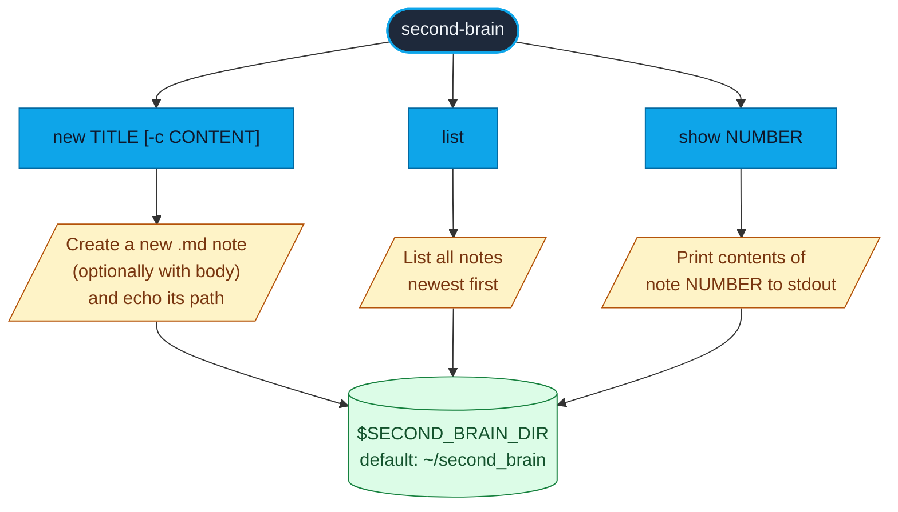

# second-brain — CLI commands



## Examples

```bash
$ second-brain new "Idea: rewrite parser"
/Users/me/second_brain/2026-05-07-idea-rewrite-parser.md

$ second-brain new "Quick capture" -c "Body content here"
/Users/me/second_brain/2026-05-07-quick-capture.md

$ second-brain list
Notes: /Users/me/second_brain
1. 2026-05-07-idea-rewrite-parser.md
2. 2026-05-06-meeting-notes.md

$ second-brain show 1
# Idea: rewrite parser
...
```

Source: `src/second_brain/cli.py`
